# MULTIPLICADOR 
###     INTEGRANTES:
+ Juan David Medellin Calderon 
+ Julian Esnet Riveros Acosta
+ Ana Sofia Heredia Silva 
+ Michel Steven Gaona Muñoz

### Documentación del código

Un multiplicador es una herramienta que permite combinar dos o más números para obtener un producto. En términos simples, es una forma rápida de sumar un número varias veces. En el mundo digital, un multiplicador es un circuito que opera con números binarios (0 y 1), procesando dos entradas y, mediante un algoritmo de sumas y desplazamientos de bits, genera el resultado total o producto final. Esto se puede observar en la siguiente imagen, que muestra el proceso paso a paso de una multiplicación simple.

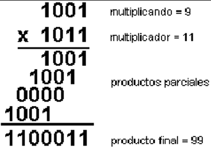

Entendiendo el concepto básico de la multiplicación, se desarrolla un código utilizando máquinas de estados finitos (FSM), que avanza por diferentes estados o fases y realiza operaciones específicas en cada uno. Esto nos permite gestionar el proceso de multiplicación de manera secuencial.

El diagrama que se muestra en la siguiente imagen, ilustra cómo la FSM controla el flujo de la multiplicación. En cada estado, el sistema ejecuta acciones dependiendo de las señales de control y los valores de los registros internos. El proceso comienza en el estado START y pasa por varias etapas, como CHECK, ADD, SHIFT y END1, dependiendo de las condiciones internas, como el valor del bit menos significativo del multiplicador y si el registro ha llegado a cero. Esta secuencia garantiza que la multiplicación se realice de forma ordenada y eficaz.

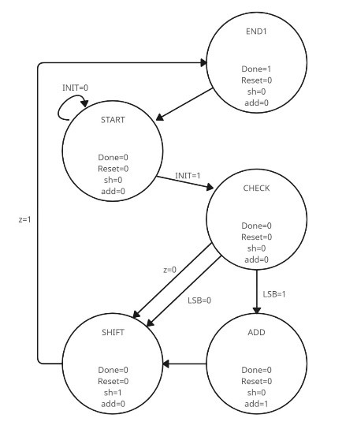

### Explicación del código:

Primero declaramos las entradas, las salidas y las variables del código.

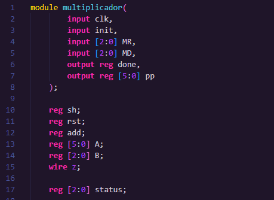
 
+ Entradas:

     + clk: Señal de reloj.

     + init: Señal de inicio para comenzar la multiplicación.

     + MR: Multiplicador (número de 3 bits).

     + MD: Multiplicando (número de 3 bits).

+ Salidas:
     + done: Señal que indica si la multiplicación ha terminado.

     + pp: Producto parcial acumulado (resultado de la multiplicación, de 6 bits).

+ Variables 

     + sh y add: Son señales de control que determinan si se debe realizar un desplazamiento o una suma en cada ciclo del reloj.

     + rst: Es la señal de reinicio que inicializa los registros A, B y pp.

    + A: Registra el valor del multiplicando (MD), extendido a 6 bits para soportar el desplazamiento.

    + B: Registra el valor del multiplicador (MR), que se usa para controlar el flujo de la multiplicación.
    
    + status: Es un registro que mantiene el estado actual de la máquina de estados finitos (FSM).

    + z: Señal que indica cuando B ha llegado a 0.
El funcionamiento del multiplicador comienza cuando se activa la señal de inicio, init. Esta señal habilita el sistema para iniciar el proceso. El código utiliza una máquina de estados finitos (FSM) de 5 fases, y cada fase de la FSM maneja diferentes etapas de la multiplicación.

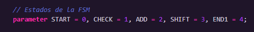

En el estado START, la FSM está esperando la activación de la señal init. Mientras está en este estado, las señales add, sh, y rst están desactivadas. Cuando la señal init se activa, es decir, cuando recibe un valor de 1, la FSM cambia al estado CHECK. En este momento, la señal rst es 1, la cual inicializa los valores de A con un valor de 6 bits, donde los primeros tres bits son ceros y los últimos seis bits corresponden a MD y B inicializa con valor de MR, además que la salida pp inicia en 0.

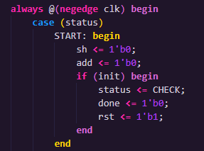

En el estado CHECK, la FSM evalúa el bit menos significativo del multiplicador B. En este estado, las señales add, sh, y rst están en 0. La FSM decide el siguiente estado tomando como referencia el valor del bit menos significativo de B. Si este bit es 1, la FSM cambia al estado ADD, pero si es 0, pasa al estado SHIFT.

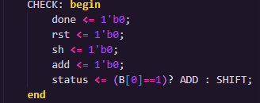

En el estado ADD, cuando la señal add se activa, esta está indicando que el multiplicando A, debe ser sumado al producto acumulado pp. Durante este estado, las señales sh y rst están desactivadas. Una vez realizada la suma, la FSM cambia al estado SHIFT.

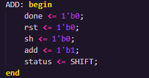

En el estado SHIFT, la señal sh es igual a 1, indica que los registros A y B deben ser desplazados. A se desplaza a la izquierda y B se desplaza a la derecha. Durante este estado, la señal add está desactivada, y la señal rst también lo está. Luego, se evalúa si B ha llegado a 0. Si B es igual a 0, la FSM cambia al estado END1. Si no, regresa al estado CHECK para continuar el ciclo de multiplicación.

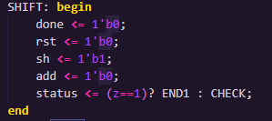

Finalmente, en el estado END1, la señal done se activa (done <= 1), indicando que la multiplicación ha terminado. En este estado, las señales add, sh, y rst son iguales a 0. La FSM regresa al estado START para iniciar con una nueva multiplicación

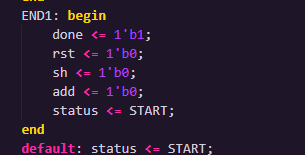

Por otro lado, vamos a detallar la explicación de los bloques always que se encuentran aparte de la FSM, aunque ya los habíamos mencionado antes. 

El primer bloque always @(posedge clk) maneja el desplazamiento de los registros A y B. Cuando rst está activo, A se inicializa con MD y B con MR. Cuando sh está activo, A se desplaza a la izquierda y B a la derecha en cada ciclo del reloj, lo cual es fundamental para la multiplicación binaria.

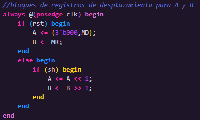

El segundo bloque always @(posedge clk) se encarga de sumar los productos parciales en pp. Si rst está activo, pp se pone a 0. Cuando add está activo, el valor de A se suma a pp, acumulando los productos parciales para obtener el resultado final de la multiplicación.

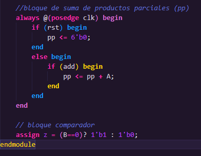

Por último, podemos ver los resultados obtenidos por el sistema en la siguiente simulación. Aquí se muestra cómo las señales de control afectan al registro pp, acumulando los productos parciales y mostrando que el multiplicador funciona correctamente.

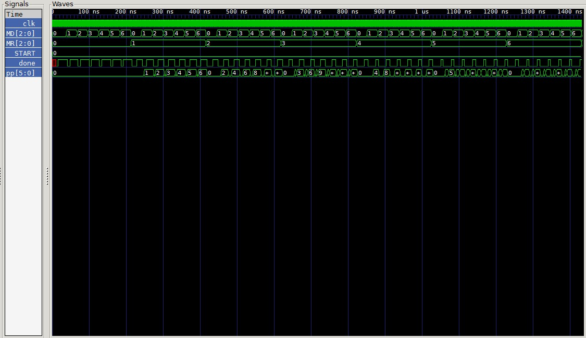