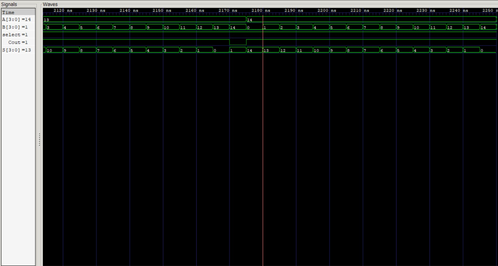
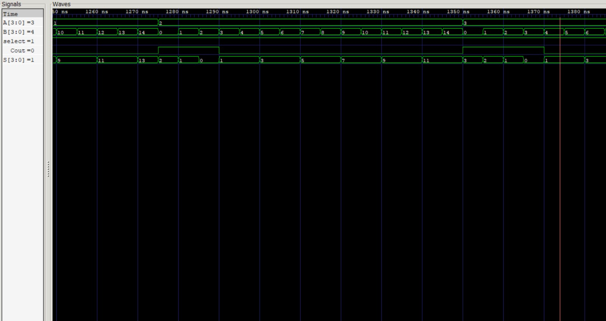
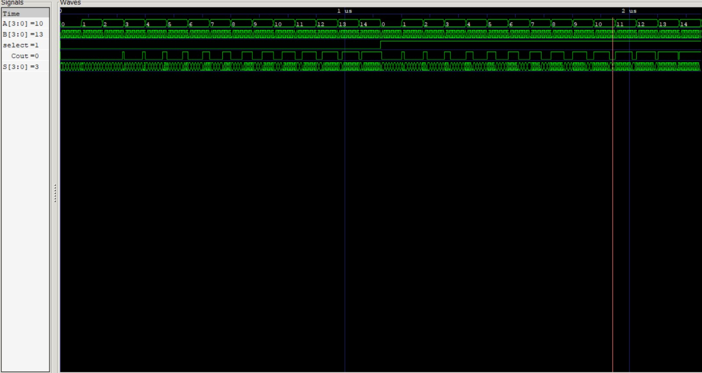
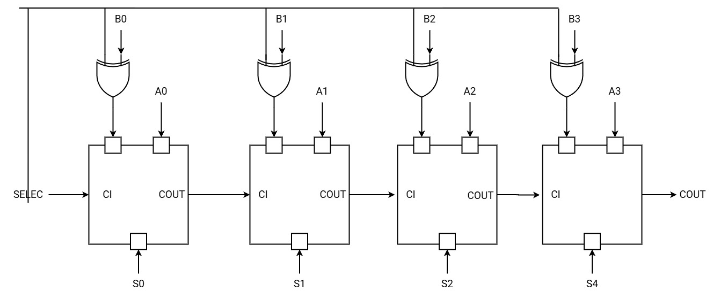

# Informe: Implementación de un Restador de 4 Bits Basado en un Sumador de 4 Bits utilizando Quartus y Compuertas Lógicas
## 1. Introducción
En este informe, se describe el diseño de un restador de 4 bits utilizando un sumador de 4 bits, que es una técnica ampliamente utilizada en circuitos digitales. Para llevar a cabo esta implementación, se emplea el software Quartus, una herramienta poderosa para la programación y simulación de circuitos lógicos en FPGA, y compuertas lógicas para el diseño estructural.
El objetivo es demostrar cómo, a través de la manipulación de señales y compuertas lógicas, se puede convertir un sumador en un restador utilizando el complemento a dos y un selector. Además, se proporciona el código en Verilog, un lenguaje de descripción de hardware, junto con un banco de pruebas (testbench) para validar el comportamiento del circuito.
## 2. Fundamento Teórico
Un restador de 4 bits puede implementarse de manera eficiente a partir de un sumador de 4 bits. La idea básica es aprovechar la propiedad del complemento a dos para restar dos números binarios.
## 2.1 Complemento a dos
El complemento a dos de un número binario se obtiene invirtiendo cada uno de sus bits y luego sumando uno. Para restar dos números binarios A y B, podemos sumar A al complemento a dos de B:
A−B=A+(∼B+1)
Donde "∼B" es la inversión bit a bit de B. Al incluir un bit de acarreo adicional (carry-in), que puede ser 1 o 0, podemos controlar si el circuito está realizando una suma o una resta.
## 2.2 Uso de un Sumador para Implementar un Restador
Para realizar una resta, el circuito necesita:
•	Inversión: Mediante compuertas XOR, se invierten los bits del operando B cuando se desea realizar una resta.
•	Carry-in: Un bit de acarreo que indica si se realiza una suma (0) o una resta (1).
## 3. Descripción del Circuito
El diseño del restador de 4 bits se basa en la estructura de un sumador de 4 bits. A continuación se presenta el código Verilog y su descripción.
## 3.1 Sumador de 1 bit
El sumador de 1 bit toma tres entradas: A, B, y el acarreo de entrada (Ci). Devuelve una salida de suma (Sum) y el acarreo de salida (Cout).

module sumador_1bit(
        input A, 
        input B, 
        input Ci,
        output Cout,
        output Sum
    );

    reg [1:0] result;

    assign Sum = result[0];
    assign Cout = result[1];

    always@(*) begin
        result = A+B+Ci;
    end
endmodule

Este sumador se utiliza para construir un sumador de 4 bits.
## 3.2 Sumador de 4 bits
El sumador de 4 bits se implementa concatenando cuatro sumadores de 1 bit en serie. Cada sumador de 1 bit utiliza el acarreo de salida del bit anterior como su acarreo de entrada.
verilog
Copiar código
module sumador_4bit(
        input  [3:0] A,
        input  [3:0] B,
        input        Ci,
        output       Cout,
        output [3:0] Sum
    );

    wire c1, c2, c3;

    sumador_1bit s0 (.A(A[0]), .B(B[0]), .Ci(Ci), .Cout(c1), .Sum(Sum[0]));
    sumador_1bit s1 (.A(A[1]), .B(B[1]), .Ci(c1), .Cout(c2), .Sum(Sum[1]));
    sumador_1bit s2 (.A(A[2]), .B(B[2]), .Ci(c2), .Cout(c3), .Sum(Sum[2]));
    sumador_1bit s3 (.A(A[3]), .B(B[3]), .Ci(c3), .Cout(Cout), .Sum(Sum[3]));
endmodule
## 3.3 Restador de 4 bits
El restador de 4 bits utiliza el sumador de 4 bits descrito anteriormente. Mediante el uso de compuertas XOR, los bits de B se invierten cuando se selecciona la operación de resta (select = 1). El acarreo de entrada (Ci) también se utiliza para controlar si se realiza una suma o una resta.
verilog
```
module restador_4bit(
    input [3:0] A,
    input [3:0] B,
    input       select,
    output      Cout,
    output   [3:0] S
);

    wire [3:0] Bx;
    wire [3:0] s1;

    xor(Bx[0], B[0], select);
    xor(Bx[1], B[1], select);
    xor(Bx[2], B[2], select);
    xor(Bx[3], B[3], select);

    sumador_4bit s0(.A(A), .B(Bx), .Ci(select), .Cout(Cout), .Sum(s1));

    assign S = (Cout) ? s1 : ~s1 | 1;
endmodule
```
 


## 3.4 Banco de pruebas (Testbench)
El banco de pruebas verifica el funcionamiento del restador. Se simula tanto la operación de suma como la de resta utilizando diferentes valores de entrada.
```
module restador_4bit_tb();
    reg [3:0] A_tb;
    reg [3:0] B_tb;
    reg select_tb;

    wire Cout_tb;
    wire [3:0] S_tb;

    restador_4bit uut (
        .A(A_tb), 
        .B(B_tb), 
        .select(select_tb),
        .Cout(Cout_tb), 
        .S(S_tb)
    );

    initial begin
        A_tb = 0;
        B_tb = 0;
        select_tb = 0;

        for (A_tb = 0; A_tb < 15; A_tb = A_tb + 1) begin
            for (B_tb = 0; B_tb < 15; B_tb = B_tb + 1) begin
                #5 $display("Con select 0, %d - %d = %d", A_tb, B_tb, S_tb);
            end
        end
        
        select_tb = 1;
        for (A_tb = 0; A_tb < 15; A_tb = A_tb + 1) begin
            for (B_tb = 0; B_tb < 15; B_tb = B_tb + 1) begin
                #5 $display("Con select 1, %d - %d = %d", A_tb, B_tb, S_tb);
            end
        end
        $finish;
    end

    initial begin: TEST_CASE
        $dumpfile("restador_4bit_tb.vcd");
        $dumpvars(-1, uut);
    end
endmodule

```
 ### 4. Implementación en Quartus
4.1 Creación del Proyecto
1.	Abrir Quartus y crear un nuevo proyecto.
2.	Importar los archivos Verilog de los módulos (sumador_1bit.v, sumador_4bit.v, restador_4bit.v) en el entorno de diseño.
3.	Definir el banco de pruebas (restador_4bit_tb.v) para verificar el funcionamiento del circuito.
4.2 Síntesis y Simulación
1.	Después de escribir el código Verilog, compilar el proyecto para verificar la sintaxis y la síntesis.
2.	Utilizar el simulador de Quartus para correr el banco de pruebas (testbench) y observar los resultados.
3.	Generar el archivo VCD para visualizar las formas de onda de los resultados y verificar el correcto funcionamiento del restador.
4.3 Compuertas Lógicas Utilizadas
En este circuito, se utilizan principalmente compuertas XOR para invertir los bits de B y realizar la resta. El sumador de 1 bit utiliza compuertas AND, OR y XOR para realizar las operaciones de suma y acarreo.
5. Conclusión
Este informe muestra cómo un restador de 4 bits puede implementarse eficientemente utilizando un sumador de 4 bits, compuertas XOR y el complemento a dos. El uso de Quartus facilita la síntesis y simulación del circuito, permitiendo validar su funcionamiento antes de implementarlo en hardware.
Este enfoque modular y flexible facilita la creación de circuitos aritméticos más complejos, y demuestra cómo conceptos teóricos como el complemento a dos y el acarreo pueden aprovecharse en circuitos digitales prácticos.
Implementación Práctica de un Restador de 4 Bits con Compuertas Lógicas

### En esta sección se describirá cómo implementar el circuito de un restador de 4 bits utilizando compuertas lógicas básicas (AND, OR, XOR, NOT) en lugar de utilizar un lenguaje de descripción de hardware como Verilog. El objetivo es demostrar la construcción manual del circuito y cómo se relaciona con la implementación lógica de un restador basado en un sumador.
## 1. Restador de 4 Bits Basado en un Sumador
Como se explicó anteriormente, un restador de 4 bits puede construirse a partir de un sumador de 4 bits utilizando el complemento a dos. La estructura fundamental de este circuito incluye:
•	Sumadores de 1 bit en cascada para sumar los bits.
•	Compuertas XOR para invertir los bits del segundo operando (B) cuando se realiza la resta.
## 2. Diseño del Circuito del Restador con Compuertas Lógicas
El diseño de un restador de 4 bits se puede hacer descomponiendo el circuito en operaciones lógicas. Cada bit del circuito de suma/resta será procesado con un sumador completo (Full Adder) que puede implementarse con las siguientes ecuaciones lógicas:
•	Suma (Sum):
Sum=A⊕B⊕Ci\text{Sum} = A \oplus B \oplus CiSum=A⊕B⊕Ci
Donde AAA y BBB son los bits de entrada, CiCiCi es el bit de acarreo de entrada, y ⊕\oplus⊕ representa la operación XOR.
•	Acarreo (Cout):
Cout=(A⋅B)+(Ci⋅(A⊕B))\text{Cout} = (A \cdot B) + (Ci \cdot (A \oplus B))Cout=(A⋅B)+(Ci⋅(A⊕B))
Donde ⋅\cdot⋅ es la operación AND y +++ es la operación OR.
## 3. Compuertas Lógicas para la Implementación del Sumador Completo
Cada bit de la operación de suma/resta utiliza un sumador completo (Full Adder), que se puede construir con las siguientes compuertas lógicas:
•	XOR: Utilizada para calcular la suma de dos bits (A, B) junto con el acarreo de entrada (Ci).
•	AND y OR: Utilizadas para generar el acarreo de salida (Cout).
## 4. Proceso de Resta con Compuertas Lógicas
Para realizar la resta A−BA - BA−B, el operando BBB debe invertirse (operación de complemento a dos). Esto se logra utilizando compuertas XOR:
•	Cuando el bit select es 1 (operación de resta), las compuertas XOR invierten cada bit de B. Esto equivale a:
Bx=B⊕select\text{Bx} = B \oplus \text{select}Bx=B⊕select
Donde select es el bit que define si se realiza una suma (select = 0) o una resta (select = 1).
## 5. Diagrama del Circuito de Restador de 1 Bit con Compuertas
Un circuito restador de 1 bit que utiliza compuertas lógicas puede representarse de la siguiente manera:
1.	Entradas: A, B, y el acarreo de entrada (Ci).
2.	Compuertas XOR: Para invertir B cuando se está restando.
3.	Sumador Completo:
o	Una compuerta XOR calcula la suma parcial de A⊕B⊕CiA \oplus B \oplus CiA⊕B⊕Ci.
o	Compuertas AND y OR calculan el acarreo de salida.
## 6. Construcción del Restador de 4 Bits



El restador de 4 bits se construye concatenando cuatro sumadores completos de 1 bit en cascada. Cada bit se resta con base en los siguientes pasos:
1.	Invertir B: Utilizar compuertas XOR para invertir cada bit de B si se selecciona la operación de resta.
2.	Sumar/Acarrear: Para cada par de bits AiA_iAi y BiB_iBi, utilizar un sumador completo que calcule la suma parcial y el acarreo.
3.	Propagación del Acarreo: El acarreo de cada sumador se propaga al siguiente bit más significativo.
## 7. Diagrama del Restador Completo de 4 Bits
Para construir el circuito con compuertas lógicas, el esquema completo del restador de 4 bits tendría la siguiente estructura:
 #### 1.	XOR para B: Cada bit de B pasa por una compuerta XOR controlada por el bit select para invertir sus valores si se desea restar.
#### 2.	Sumadores Completos: Cada sumador completo procesa un par de bits AiA_iAi y BxiBx_iBxi junto con el acarreo proveniente del bit menos significativo.
#### 3.	Salida: Las salidas del circuito serán los bits de la diferencia S[3:0]S[3:0]S[3:0] y el acarreo de salida CoutCoutCout, que indica si ocurrió un desbordamiento en la operación.
### 8. Simulación del Circuito en Quartus
#### 8.1 Uso de Quartus para Implementar el Circuito con Compuertas
•	Crear un nuevo proyecto en Quartus y utilizar el editor gráfico para construir el circuito de sumador completo utilizando compuertas lógicas (AND, OR, XOR, NOT).
•	Implementar el restador de 4 bits conectando cuatro sumadores completos en cascada.
•	Utilizar el módulo testbench para simular diferentes entradas y verificar la correcta operación del restador para diferentes valores de A, B y select.
#### 8.2 Análisis de Resultados
•	Verificar la salida del circuito mediante simulaciones de diferentes casos, como la resta de números positivos, negativos y el manejo de desbordamiento (cuando A < B).
•	Asegurarse de que el circuito responde adecuadamente cuando el bit select cambia entre 0 (suma) y 1 (resta).
9. Conclusión
En este informe se ha demostrado cómo construir un restador de 4 bits utilizando compuertas lógicas básicas. La implementación se basa en la estructura de un sumador completo, combinando operaciones XOR, AND y OR para realizar tanto la suma como la resta. La simulación en Quartus confirma el funcionamiento correcto del circuito, mostrando cómo se puede realizar aritmética binaria en hardware digital.
Esta implementación manual con compuertas lógicas es un paso clave para entender cómo los componentes fundamentales de la electrónica digital interactúan y permiten la construcción de circuitos aritméticos más complejos.


Para construir el circuito con compuertas lógicas, el esquema completo del restador de 4 bits tendría la siguiente estructura:

XOR para B: Cada bit de B pasa por una compuerta XOR controlada por el bit select para invertir sus valores si se desea restar.
Sumadores Completos: Cada sumador completo procesa un par de bits 
𝐴
𝑖
A 
i
​
  y 
𝐵
𝑥
𝑖
Bx 
i
​
  junto con el acarreo proveniente del bit menos significativo.
Salida: Las salidas del circuito serán los bits de la diferencia 
𝑆
[
3
:
0
]
S[3:0] y el acarreo de salida 
𝐶
𝑜
𝑢
𝑡
Cout, que indica si ocurrió un desbordamiento en la operación.
8. Simulación del Circuito en Quartus
8.1 Uso de Quartus para Implementar el Circuito con Compuertas
Crear un nuevo proyecto en Quartus y utilizar el editor gráfico para construir el circuito de sumador completo utilizando compuertas lógicas (AND, OR, XOR, NOT).
Implementar el restador de 4 bits conectando cuatro sumadores completos en cascada.
Utilizar el módulo testbench para simular diferentes entradas y verificar la correcta operación del restador para diferentes valores de A, B y select.
8.2 Análisis de Resultados
Verificar la salida del circuito mediante simulaciones de diferentes casos, como la resta de números positivos, negativos y el manejo de desbordamiento (cuando A < B).
Asegurarse de que el circuito responde adecuadamente cuando el bit select cambia entre 0 (suma) y 1 (resta).
9. Conclusión
En este informe se ha demostrado cómo construir un restador de 4 bits utilizando compuertas lógicas básicas. La implementación se basa en la estructura de un sumador completo, combinando operaciones XOR, AND y OR para realizar tanto la suma como la resta. La simulación en Quartus confirma el funcionamiento correcto del circuito, mostrando cómo se puede realizar aritmética binaria en hardware digital.

