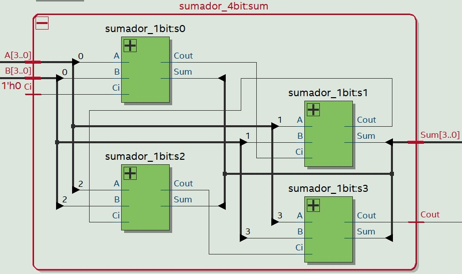
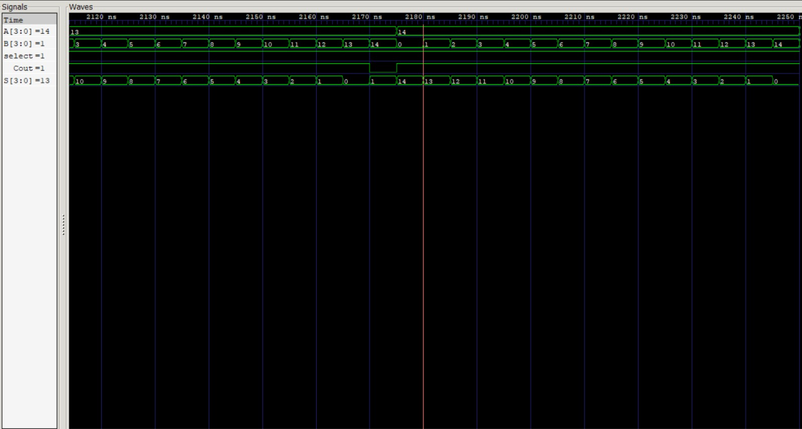
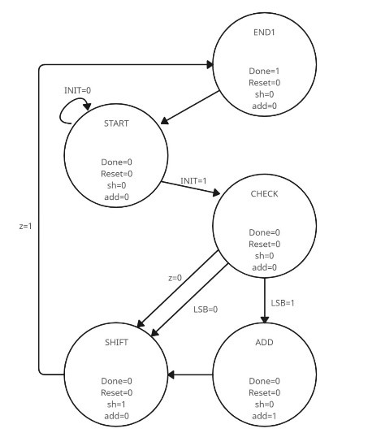
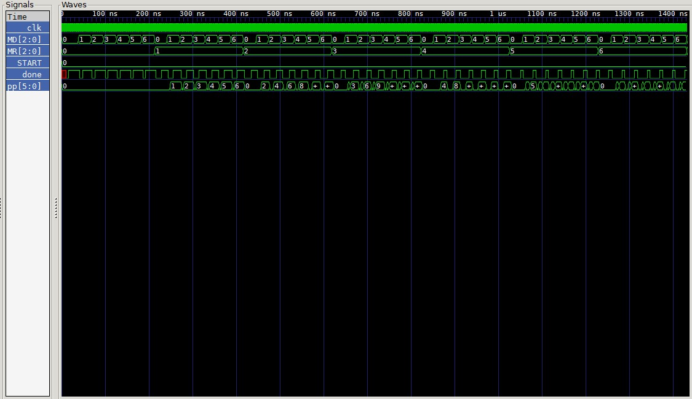
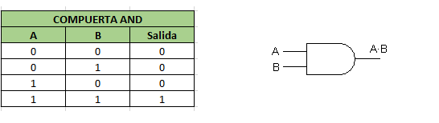
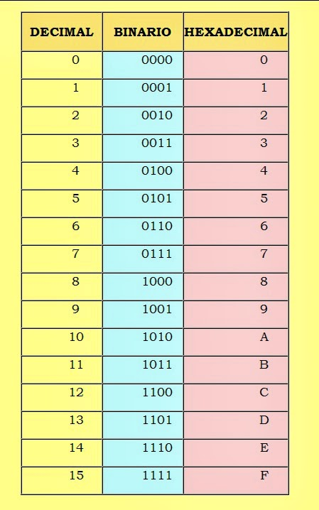
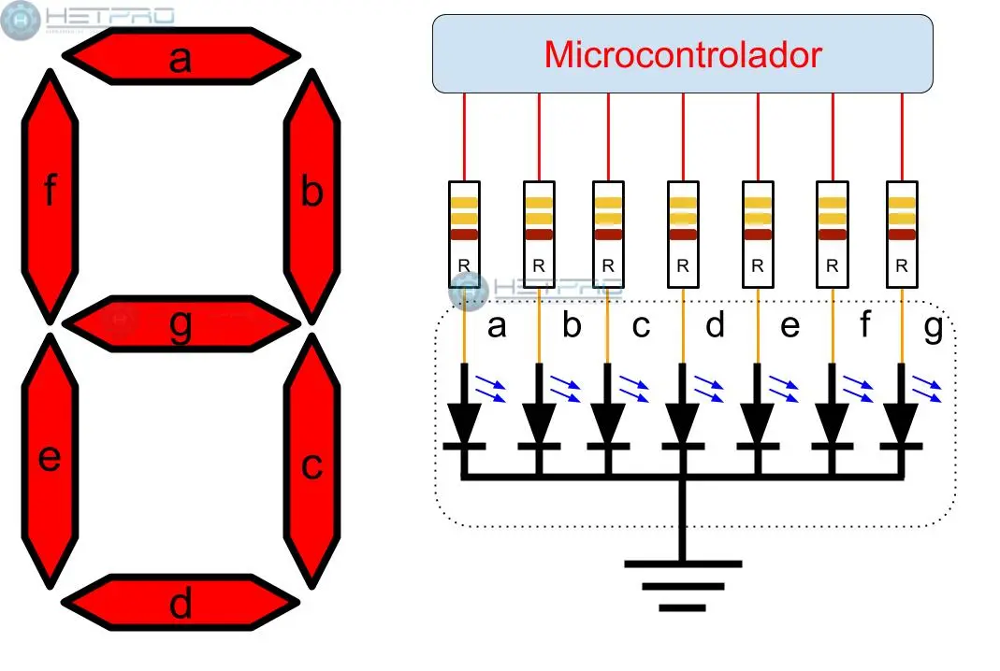

# ALU - UNIDAD LÓGICA ARITMÉTICA
###     INTEGRANTES:
+ Juan David Medellin Calderon 
+ Julian Esnet Riveros Acosta
+ Ana Sofia Heredia Silva 
+ Michel Steven Gaona Muñoz

### Documentación del código
<p style="text-align: justify;">Una Unidad Lógica Aritmética (ALU) es un componente fundamental en sistemas digitales y procesadores, encargada de realizar operaciones aritméticas y lógicas básicas. En este proyecto, se ha desarrollado una ALU capaz de ejecutar cuatro operaciones: suma, resta, multiplicación y una operación lógica AND. Los resultados de estas operaciones se visualizan en displays de siete segmentos de manera hexadecimal.

A continuación, se explicará cada uno de los códigos desarrollados para implementar estas funciones dentro de la ALU.</p>
#### SUMADOR DE 1 BIT
<p style="text-align: justify;">Un sumador es un circuito digital que suma dos o más números binarios y genera una salida que representa la suma, junto con una señal de acarreo si es necesario.</p>

#### Explicación del código
```module sumador_1bit(
        input A,
        input B,
        input Ci,
        output Cout,
        output Sum
    );

    wire a_ab;
    wire x_ab;
    wire count_t;

    and(a_ab, A, B);
    xor(x_ab, A, B);

    xor(Sum, x_ab, Ci);
    and(count_t, x_ab, Ci);

    or(Cout, count_t, a_ab);
endmodule
```
<p style="text-align: justify;">El módulo sumador_1bit implementa esta funcionalidad para dos bits de entrada, A y B, junto con una entrada de acarreo (Ci). Utiliza puertas lógicas para calcular la suma (S) y el acarreo (cout). Primero, se generan dos señales intermedias: a_ab, que es el resultado de la operación AND de A y B, y x_ab, que resulta de la operación XOR de A y B. La suma se obtiene aplicando una XOR entre x_ab y Ci, mientras que el acarreo se determina mediante una puerta OR que combina count_t (AND de x_ab y Ci) y a_ab. De este modo, el módulo proporciona el resultado correcto de la suma de un solo bit.</p>

#### Esquemático Quartus
<div align="center">
    
</div>

#### Diagrama 
<div align="center">
    
</div>

### SUMADOR DE 4 BIT
<p style="text-align: justify;">
La suma es una de las operaciones aritméticas más fundamentales y esenciales en matemáticas y en la computación. En el contexto de los sistemas digitales, la suma se realiza en formato binario, donde los números se representan con dígitos de 0 y 1.</p>

```
module sumador_4bit_tb();
    reg [3:0] A_tb;
    reg [3:0] B_tb;

    wire Cout_tb;
    wire [3:0] Sum_tb;

    // Instantiate the Unit Under Test (UUT)
    sumador_4bit uut (
        .A(A_tb), 
        .B(B_tb), 
        .Cout(Cout_tb), 
        .Sum(Sum_tb)
    );

    initial begin
        A_tb=0;

        for(A_tb = 0; A_tb < 15; A_tb = A_tb + 1) begin
            for(B_tb = 0; B_tb < 15; B_tb = B_tb + 1) begin
                #5 $display("el valor de %d + %d = %d", A_tb, B_tb, Sum_tb);
            end
        end
        $finish;
    end      

    initial begin: TEST_CASE
        $dumpfile("sumador_4bit_tb.vcd");
        $dumpvars(-1, uut);
    end
endmodule
```

<p style="text-align: justify;">Un sumador de 4 bits es un circuito digital que suma dos números binarios de 4 bits y genera una salida que representa la suma total, junto con una señal de acarreo (Cout). El módulo sumador_4bit implementa esta funcionalidad utilizando cuatro instancias del sumador de 1 bit (sumador_1bit). Cada instancia toma un bit correspondiente de las entradas A y B, así como un acarreo de la suma anterior.</p>

<p style="text-align: justify;">En el código, se definen tres señales intermedias (c1, c2, c3) para gestionar los acarreos entre los sumadores. La primera instancia (s0) suma los bits menos significativos de A y B, junto con la entrada de acarreo inicial (Ci). Las siguientes instancias (s1, s2, s3) realizan la suma de los siguientes bits, utilizando el acarreo generado por la instancia anterior. Finalmente, la salida Sum contiene la suma total de 4 bits, mientras que Cout indica si hubo un acarreo adicional.</p>

#### Esquemático Quartus
<div align="center">
    
</div>

#### Simulación
<div align="center">
    
</div>

### RESTADOR DE 4 BIT 

<p style="text-align: justify;">
Un restador es un circuito digital que realiza la operación de resta entre dos números binarios. En el contexto de la lógica digital, la resta se implementa comúnmente utilizando el complemento a dos, que permite transformar la operación de resta en una suma, donde el bit más significativo actúa como el bit de signo. Esto se logra invirtiendo los bits del segundo operando y sumando uno al resultado. Así, el restador puede manejar tanto restas positivas como negativas. </p>

#### Explicación del código 
```
module restador_4bit(
    input [3:0] A,
    input [3:0] B,
    input       Select,
    output      Cout,
    output [3:0] Res
);

    wire [3:0] Bx;
    wire [3:0] s;

    xor(Bx[0], B[0], Select);
    xor(Bx[1], B[1], Select);
    xor(Bx[2], B[2], Select);
    xor(Bx[3], B[3], Select);

    sumador_4bit s0(.A(A), .B(Bx), .Ci(Select), .Cout(Cout), .Sum(s));

    assign Res = (Cout) ? s : ~s + 1'b1;
endmodule
```

<p style="text-align: justify;">El módulo restador_4bit realiza la resta de dos números de 4 bits. Tiene como entradas el primer operando A, el segundo operando B y una señal de control Select. Las salidas son Cout, que indica si hay un "carry out", y Res, que contiene el resultado de la resta.</p>

<p style="text-align: justify;">Para generar el complemento a dos de B, se utiliza Select. Al aplicar una operación XOR entre cada bit de B y Select, el cable Bx almacena los nuevos valores. Si Select es 1, los bits de B se invierten, permitiendo que se realice la resta correctamente.</p>

<p style="text-align: justify;">El módulo llama al sumador de 4 bits, pasando A y Bx. La línea assign Res = (Cout) ? s : ~s + 1'b1; determina el resultado. Si hay un Cout, se devuelve s; de lo contrario, se utiliza el complemento a dos de s. Así, el restador maneja eficientemente tanto restas positivas como negativas.</p>

#### Esquemático Quartus
<div align="center">
    
</div>

#### Esquemático 
<div align="center">
    
</div>

#### Simulación 
<div align="center">
    
</div>

### MULTIPLICADOR
<p style="text-align: justify;">
Un multiplicador es un circuito digital que realiza la multiplicación de dos números binarios. Esta se lleva a cabo mediante la suma de productos parciales, un proceso similar al método tradicional de multiplicación decimal, pero adaptado para operaciones binarias. En este caso, se utiliza una Máquina de Estados Finitos (FSM) para coordinar las etapas de la multiplicación, incluyendo la suma y el desplazamiento de los números.</p>

#### Explicación del código
<p style="text-align: justify;">El módulo multiplicador implementa la multiplicación de dos números de 4 bits, MR (Multiplicador) y MD (Multiplicando), y almacena el resultado en pp (producto parcial), que tiene un tamaño de 8 bits para capturar el resultado completo.</p>

``` 
module multiplicador(
        input clk,
        input init,    
        input [3:0] MR, 
        input [3:0] MD, 
        output reg done,
        output reg [7:0] pp
    );

    reg sh;
    reg rst;
    reg add;
    reg [7:0] A;
    reg [3:0] B;
    wire z;

    reg [2:0] status;
```
<p style="text-align: justify;">La FSM tiene cinco estados principales: START, CHECK, ADD, SHIFT y END1. En el estado START, se inicializan las variables y se espera la señal de inicio init. Una vez activa, el estado CHECK determina si el bit menos significativo de B (el multiplicador) es 1. Si lo es, pasa al estado ADD para sumar el producto parcial actual a A. Después, en el estado SHIFT, los registros se desplazan: A se desplaza a la izquierda y B a la derecha. Este ciclo se repite hasta que B se convierte en 0, lo cual se detecta en el estado SHIFT, donde se decide si continuar o finalizar la operación en el estado END1, donde se establece la señal done indicando que la multiplicación ha terminado.</p>

```
// Estados de la FSM 
parameter START = 0, CHECK = 1, ADD = 2, SHIFT = 3, END1 = 4;

    initial begin
        status = START;
        rst = 1'b0;
        pp = 8'b0;
        A = 8'b0;
        B = 4'b0; 
    end

    always @(negedge clk) begin
        case (status)
            START: begin
                sh <= 1'b0;
                add <= 1'b0;
                if (init) begin
                    status <= CHECK;
                    done <= 1'b0;
                    rst <= 1'b1;
                end
            end
            CHECK: begin 
                done <= 1'b0;
                rst <= 1'b0;
                sh <= 1'b0;
                add <= 1'b0;
                status <= (B[0]==1)? ADD : SHIFT;
            end
            ADD: begin
                done <= 1'b0;
                rst <= 1'b0;
                sh <= 1'b0;
                add <= 1'b1;
                status <= SHIFT;
            end
            SHIFT: begin
                done <= 1'b0;
                rst <= 1'b0;
                sh <= 1'b1;
                add <= 1'b0;
                status <= (z==1)? END1 : CHECK;
            end
            END1: begin
                done <= 1'b1;
                rst <= 1'b0;
                sh <= 1'b0;
                add <= 1'b0;
                status <= START;
            end
            default: status <= START;
        endcase 
    end 
```
<p style="text-align: justify;">Durante el proceso, el bloque de desplazamiento mueve los bits de A y B, y el bloque de suma actualiza pp agregando el valor de A cuando es necesario. El comparador simplemente verifica si B es igual a 0 para finalizar la operación.</p>

```
    //bloques de registros de desplazamiento para A y B
    always @(posedge clk) begin
        if (rst) begin
            A <= {4'b000,MD};
            B <= MR;
        end
        else begin 
            if (sh) begin
                A <= A << 1;
                B <= B >> 1;
            end
        end
    end 

    //bloque de suma de productos parciales (pp)
    always @(posedge clk) begin
        if (rst) begin
            pp <= 8'b0;
        end
        else begin 
            if (add) begin
                pp <= pp + A;
            end
        end
    end

    // bloque comparador 
    assign z = (B==0)? 1'b1 : 1'b0;
endmodule
```
#### Diagrama de estado 
<div align="center">
    
</div>

#### Simulación
<div align="center">
    
</div>

#### Esquemático Quartus
<div align="center">
    
</div>

### OPERACIÓN AND LOGICA
<p style="text-align: justify;">Una compuerta AND es un circuito lógico que realiza la operación lógica de conjunción. En esta operación, la salida es 1 solo si ambas entradas son 1, de lo contrario, la salida es 0. Las compuertas AND se utilizan comúnmente en circuitos digitales para combinar señales y tomar decisiones basadas en múltiples condiciones.</p>

<div align="center">
    
</div>

### Expliación del código

```
module and0(
    input [3:0] A,
    input [3:0] B,
    output [3:0] Sal
);

    assign Sal = A & B;
```

endmodule
<p style="text-align: justify;">El módulo and0 implementa una operación AND bit a bit entre dos entradas de 4 bits, A y B. Cada bit de la salida Sal es el resultado de aplicar la operación AND entre los bits correspondientes de A y B. La línea assign Sal = A & B; realiza la operación, generando una salida de 4 bits donde cada bit es el resultado de comparar los bits correspondientes de las entradas.</p>

### CONFIGURACIÓN DE DISPLAYS
#### 1. Númerologia 

<p style="text-align: justify;">Un display de siete segmentos es un dispositivo que usa siete LEDs para mostrar números del 0 al 9. Para el desarrollo de la practica se requiere del formato hexadecimal, que es un sistema numérico base 16, que incluye los dígitos del 0 al 9 y las letras A-F para representar valores del 10 al 15, como se muestra en la siguiente imagen.</p>
<div align="center">
    
</div>

#### Explicación del código
<p style="text-align: justify;">El módulo displayNum se encarga de controlar un display de siete segmentos para mostrar números en formato hexadecimal. La entrada del módulo, num, es un número de 4 bits que corresponde al valor que se quiere mostrar, mientras que la salida seg es un vector de 7 bits que controla los segmentos del display. Cada bit en seg determina si un segmento del display está encendido (0) o apagado (1).</p>

```
module displayNum(
    input [3:0] num,
    output reg [6:0] seg
);
    always @(num) begin
        case (num)
            0:seg = 7'b0000001;
            1:seg = 7'b1001111;
            2:seg = 7'b0010010;
            3:seg = 7'b0000110;
            4:seg = 7'b1001100;
            5:seg = 7'b0100100;
            6:seg = 7'b0100000;
            7:seg = 7'b0001111;
            8:seg = 7'b0000000;
            9:seg = 7'b0000100;
            10:seg = 7'b0001000;
            11:seg = 7'b0000011;
            12:seg = 7'b1000110;
            13:seg = 7'b0100001;
            14:seg = 7'b0000110;
            15:seg = 7'b0001110;
            default:seg = 7'b1111111;
        endcase
    end
endmodule

```

<p style="text-align: justify;">El bloque always utiliza un case para comparar el valor de num y asignar la configuración correspondiente al display, según su data sheet:</p>
<div align="center">
    
</div>

<p style="text-align: justify;">Por ejemplo, si num es 0, la configuración 7'b0000001 enciende los segmentos necesarios para mostrar el dígito 0.
Si num es 10, se muestra la letra "A" usando la configuración 7'b0001000. 

Esto se repite para todos los valores de 0 a 15, mostrando dígitos y letras (A–F) en hexadecimal.

El default en el case asegura que si se introduce un valor fuera del rango esperado, todos los segmentos del display se apaguen (7'b1111111).</p>

#### 2. Operadores lógicos

<p style="text-align: justify;">En el módulo displayOpe, se utiliza para mostrar los siguientes símbolos para representar las operaciones en el display de siete segmentos:</p>

+ 'U': Representa la operación de suma.
+ 'A': Representa la operación AND.
+ 'H': Representa la operación de multiplicación.
+ '-': Representa la operación de resta.
+ '=': Se utiliza para indicar el resultado de la operación.
<p style="text-align: justify;">Estos símbolos permiten visualizar claramente las operaciones y resultados en el display, facilitando la comprensión del funcionamiento del módulo.

Para realizar este proceso, se tomó como ejemplo el módulo de display, destinado a los números.</p>
```
module displayOpe(
    input [3:0] ope,
    output reg [6:0] seg
);
    always @(ope) begin
        case (ope)
            0:seg = 7'b0011101;
            1:seg = 7'b0111111;
            2:seg = 7'b0001001;
            3:seg = 7'b0001000;
            4:seg = 7'b0110111;
            default:seg = 7'b1111111;
        endcase
    end
endmodule
```
#### Esquemático Quartus
<div align="center">
    
</div>

### IMPLEMENTACIÓN DEL CODIGO GENERAL
<p style="text-align: justify;">El código principal de la ALU, es el módulo top, que integra todas las funcionalidades necesarias para realizar operaciones aritméticas y lógicas sobre dos números de 4 bits. Este módulo recibe las entradas correspondientes y gestiona el flujo de datos entre las diferentes partes del sistema. 

Los parámetros de la ALU se definen mediante los siguientes ítems:</p>

| opcode | operación enteros positivos  |
| --------- | -----:|
| 00     | SUMA                         |
| 01     | RESTA                        |
| 10     | MULTIPLICACIÓN               |
| 11     | OPERACIÓN AND LÓGICA         |

#### Explicación del código
<p style="text-align: justify;">El módulo top toma como entradas los números A y B, así como las señales de reloj (Clk), inicialización (Init) y selección de operación (Select). Dependiendo de la operación seleccionada, se envían los números a la Unidad Aritmético-Lógica (ALU), que ejecuta la operación correspondiente y devuelve el resultado. El módulo recibe dos números de 4 bits (A y B), junto con las señales de control. La ALU realiza las operaciones según el código de operación seleccionado, y los resultados se almacenan en una señal de salida alu_oup, que representa tanto el resultado de la operación como la señal de acarreo (Cout). Los resultados y las operaciones se envían a diferentes displays utilizando los módulos displayNum y displayOpe, facilitando la visualización clara de los resultados en formato hexadecimal. Por último, el registro operador se utiliza para determinar qué operación se está realizando, actualizándose de acuerdo con la selección y el estado de la ALU.</p>

```
module top (
    input [3:0] A,
    input [3:0] B,
    input Clk,
    input Init,    
    input [1:0] Select,
    output Cout,
    output Done,
    output [6:0] oup_display1,
    output [6:0] oup_display2,
    output [6:0] oup_display3,
    output [6:0] oup_display4,
    output [6:0] oup_display5,
    output [6:0] oup_display6
);

    wire [7:0] alu_oup;
    reg [3:0] operador;

    initial begin
        operador = 4'b0100;
    end

    alu alu1(.A(A), .B(B), .Clk(Clk), .Init(~Init), .Select(Select), .Cout(Cout), .Done(Done), .Sal(alu_oup));

    always @(posedge Cout or negedge Cout) begin
        if (Select == 2'b01) begin
            operador = (Cout) ? 4'b0001 : 4'b0100; 
        end
        else begin
            operador = 4'b0100;
        end
    end

    displayNum display1(.num(A), .seg(oup_display1));
    displayOpe display2(.ope({2'b00, Select}), .seg(oup_display2));
    displayNum display3(.num(B), .seg(oup_display3));
    displayOpe display4(.ope(operador), .seg(oup_display4));
    displayNum display5(.num(alu_oup[7:4]), .seg(oup_display5));
    displayNum display6(.num(alu_oup[3:0]), .seg(oup_display6));
    
endmodule
```
#### Esquemático de Quartus
<div align="center">
    
</div>

#### Simulación
<div align="center">
    
</div>

### RESULTADOS DE LA PRACTICA
#### SUMA
<div align="center">
    
</div>

#### RESTA
<div align="center">
    
</div>

#### MULTIPLICACIÓN 
<div align="center">
    
</div>

#### AND
<div align="center">
    
</div>